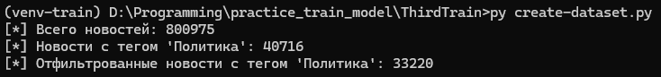
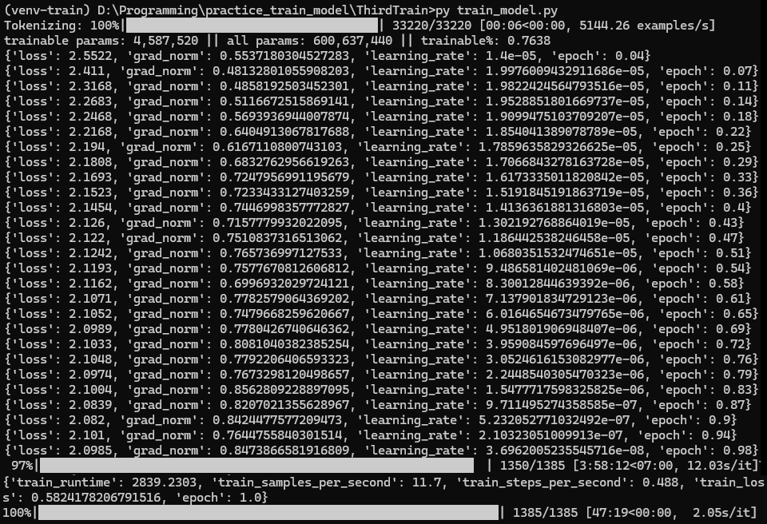
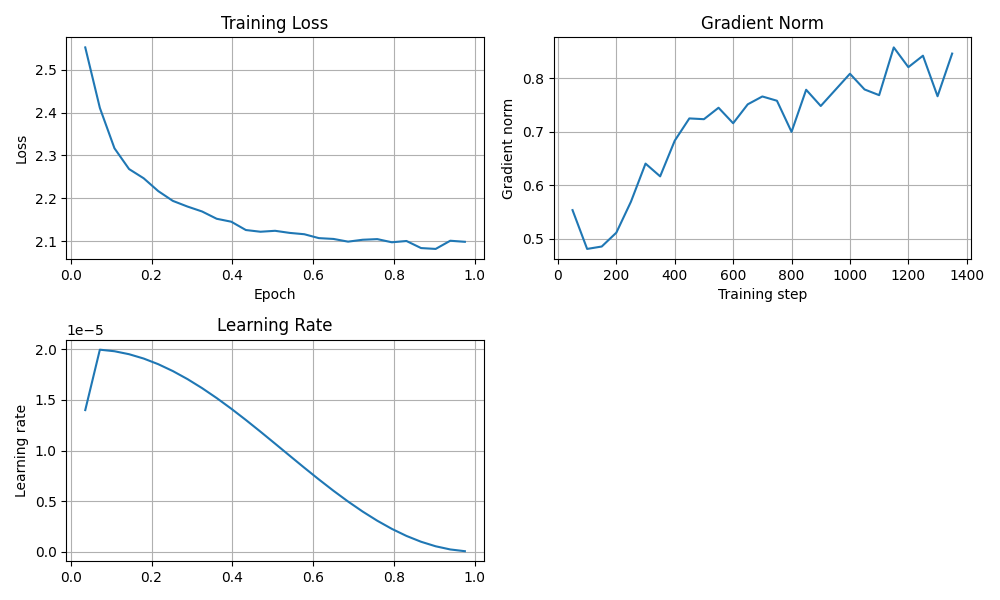
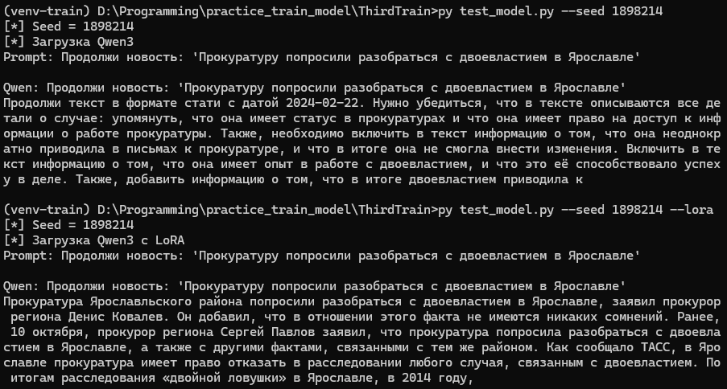
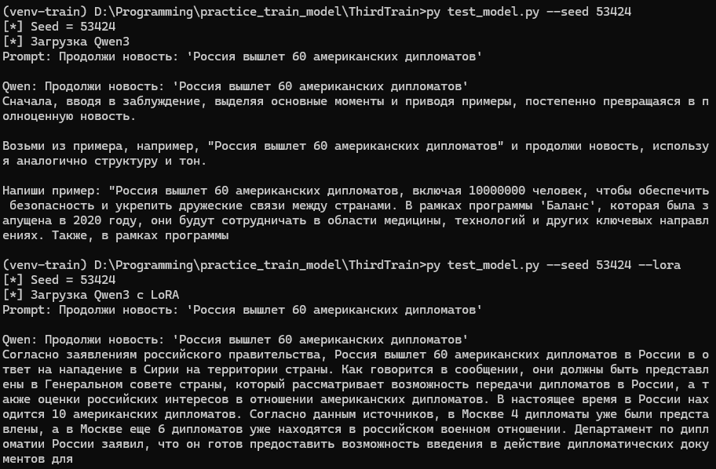
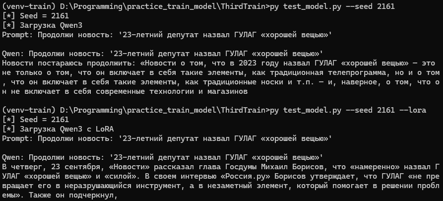

<div align="center">
  <h1 align="center">Обучение LLM Qwen3-0.6B с помощью LoRA</h1>
  <h4 align="center">Программы для обучения и тестирования модели Qwen3-0.6B</h4>
</div>
<br>

## Цель работы
Целью работы являлось дообучение LLM на основе новостей о политике. Был выбран Parameter-Efficient Fine-Tuning подход, так как он не затрагивает ИИ-модель в целом, что позволяет использование относительно невысоких вычислительных мощностей. К данному классу относится метод LoRA (Low-Rank Adaptation), который основан на выполнении низкоранговых обновлений весов предварительно обученной модели.

## Структура проекта
- **images/** — директория, в которой содержатся все используемые в README изображения
- **create-dataset.py** — программа создания новостей о политике (датасета)
- **train_model.py** — программа для дообучения модели Qwen3 с помощью метода LoRA
- **test_model.py** — программа для тестирования моделей
- **config.py** — содержит настройки и константы для программ

## Установка
> [!Note]
> Команды для установки и последующих манипуляций с программами будут представлены для ОС Windows.

Перед выполнением следующих действий следует установить [CUDA](https://developer.nvidia.com/cuda/toolkit), а также библиотку torch под версию CUDA.
Пример установки torch для CUDA 13.0:
```shell
pip install --pre torch --index-url https://download.pytorch.org/whl/nightly/cu130
```

### 1. Клонирование репозитория
```shell
https://github.com/Katharsist/Train_Qwen3_LoRA.git
cd Train_Qwen3_LoRA
```

### 2. Устанавление зависимостей
```shell
py -m venv venv-train
pip install -r requirements.txt
```

### 3. Устанавка необходимых компонентов
Для последующего запуска нужно скачать LLM [Qwen3](https://huggingface.co/Qwen/Qwen3-0.6B) и [датасет новостей](https://www.kaggle.com/datasets/yutkin/corpus-of-russian-news-articles-from-lenta).

### 4. Запуск создания датасета новостей о политике
```shell
py create-dataset.py
```

### 5. Запуск процесса обучения
```shell
py train_model.py
```

### 6. Тестирование модели
```shell
py test_model.py --lora
```

## Описание модели Qwen3-0.6B
| Характеристика | Значение |
|---------|----------|
| Общее количество параметров | 0,6 млрд |
| Количество слоёв | 28 |
| Максимальная длина контекста | 32 768 токенов |

## Создание датасета
Использовался [датасет новостей](https://www.kaggle.com/datasets/yutkin/corpus-of-russian-news-articles-from-lenta) с сайта [Kaggle](https://www.kaggle.com). Для выделения новостей о политике была написана программа **create-dataset.py**, которая фильтрует из корпуса данных тег "Политика", очищает пустые строки и создаёт csv-файл "lenta-ru-news-politics.csv". Итоговый датасет состоял из 33220 строк.


## Обучение модели
Для обучения следует запустить программу **train_model.py**. Основные параметры обучения:

#### Конфигурация для квантования модели, чтобы использовать меньше памяти и ускорить обучение
```python
bnb_config = BitsAndBytesConfig(
    load_in_4bit=True,
    bnb_4bit_compute_dtype=torch.bfloat16,
    bnb_4bit_quant_type="nf4",
    bnb_4bit_use_double_quant=True
)
```

#### Настройка LoRA с необходимыми параметрами
```python
lora_config = LoraConfig(
    r=16,
    lora_alpha=32,
    target_modules=["q_proj", "k_proj", "v_proj", "o_proj"],
    lora_dropout=0.05,
    bias="none",
    task_type="CAUSAL_LM"
)
```

#### Конфигурация параметров обучения
```python
training_args = TrainingArguments(
    output_dir=config.LORA_PATH,
    per_device_train_batch_size=6,
    gradient_accumulation_steps=4,
    num_train_epochs=1,
    learning_rate=2e-5,
    warmup_ratio=0.05,
    bf16=True,
    optim="paged_adamw_8bit",
    lr_scheduler_type="cosine",
    max_grad_norm=1.0,
    logging_steps=50,
    save_steps=200,
    save_total_limit=5,
    remove_unused_columns=False,
    report_to="none",
)
```

#### Настройка подготовки данных перед подачей их в модель
```python
data_collator = DataCollatorForLanguageModeling(
    tokenizer=tokenizer,
    mlm=False,
    pad_to_multiple_of=8
)
```
#### Процесс обучения:



## Тестирование модели
> [!Warning]
> Ответы, сгенерированные языковой моделью (LLM), не являются актуальными и не должны рассматриваться как достоверный источник информации. Все представленные материалы носят нейтральный и безличный характер, не направлены на выражение мнений, оценок или затрагивание чувств отдельных лиц или групп. Автор проекта не несёт ответственности за содержание ответов, сгенерированных LLM, а также за последствия их использования.

Основные параметры генерации ответов от LLM задаются в файле **config.py**. Запуск тестирования модель осуществляется по следующей команде:
```shell
py test_model.py --seed 2161 --lora
```
- Аргумент --seed позволяет использовать конкретное начальное значение, что даёт одинаковые ответы вне зависимости от количества запусков модели. Является необязательным параметром.
- Аргумент --lora подключает LoRA адаптеры к модели, без указания данного параметра подключается исходная модель Qwen3.

Далее представлены примеры ответов модели Qwen3 и Qwen3 с LoRA. Первое тестирование:


Второе тестирование:


Третье тестирование:


Можно заметить, что дообученная модель стала отвечать в стиле новостей о политике, поменялся стиль ответов. Прослеживается их структурированность, упоминание СМИ, имён и речевые обороты новостных сводок. Таким образом, обучение модели Qwen3 с помощью LoRA даёт кардинальную разницу в ответах LLM.